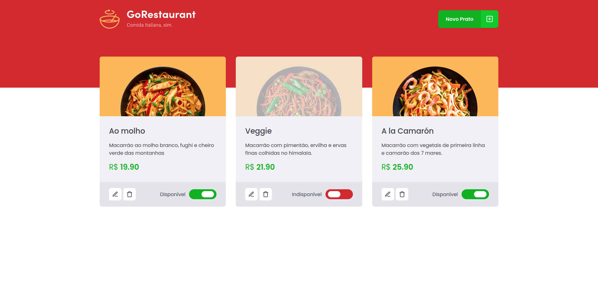
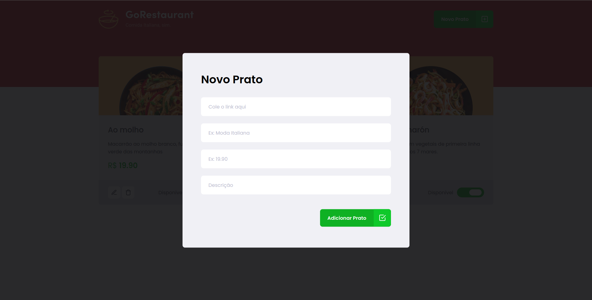
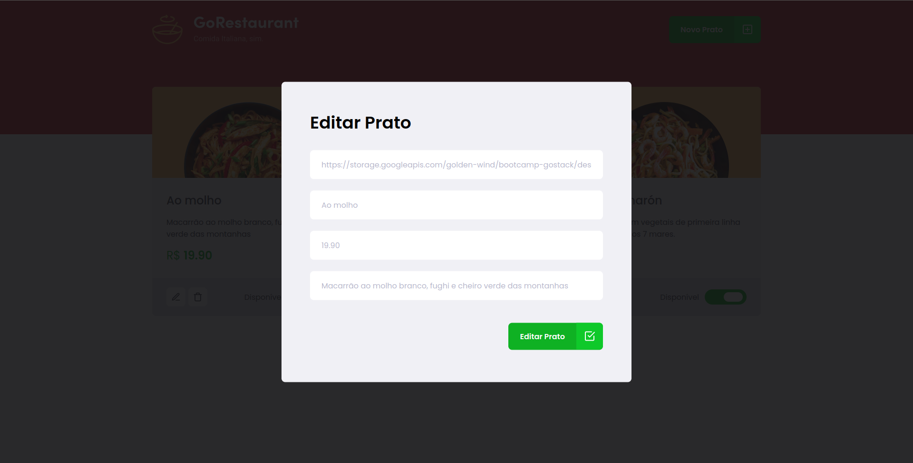
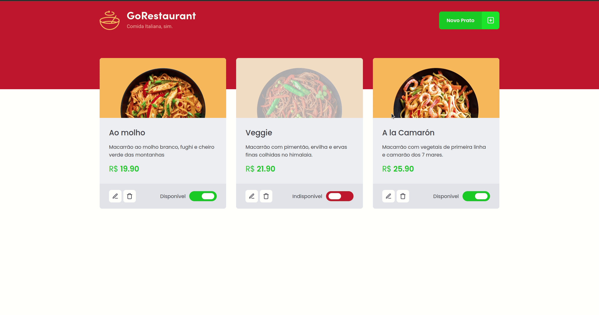

<p align="center">
  
  <br>
</p>

<h3 align="center">
  O melhor da cozinha italiana entregue de bandeja pra você!
</h3>

<br><br>

<p align="center">
  
  
  
  
</p>
<br>

<p align="center">
  <a href="#sobre">Sobre</a> •
  <a href="#gorestaurant">GoRestaurant</a> •
  <a href="#instalação">Instalação</a> •
  <a href="#tecnologias">Tecnologias</a> •
  <a href="#autor">Autor</a>  
</p>

<br><br><br>

## Sobre

Desafio do Ignite proposto na trilha de React cujo objetivo principal é refatorar a aplicação reescrevendo-a de Javascript para Typescript e de class component para functional component.

## GoRestaurant

O GoRestaurant é uma aplicação bem simples e seu propósito é servir como painel gerencial de um restaurante para que sejam realizados cadastros, exclusões, edições e indicar disponibilidade de pratos do restaurante.

Ao entrar na aplicação o usuário irá se deparar com a página principal onde estarão listados todos os pratos cadastrados no momento. Além da visualização dos dados de cada um dos pratos, ainda estão presentes na tela alguns botões de ação como de edição e remoção de prato, alteração de disponibilidade do prato e a opção de cadastrar um novo prato ao menu do restaurante, conforme exemplificado abaixo:



Ao clicar no botão para cadastrar um novo prato, o seguinte formulário será exibido em tela para que as informações do prato sejam cadastradas:



Um formulário semelhante é exibido quando clicamos no botão de editar um dos pratos cadastrados, conforme imagem a seguir:



Por fim, vamos acompanhar no GIF abaixo o fluxo completo de adição de um novo prato ao menu:



## Instalação

Antes de começar, você vai precisar ter instalado em sua máquina as seguintes ferramentas:
[Git](https://git-scm.com), [Node.js](https://nodejs.org/en/).
Além disto é bom ter um editor para trabalhar com o código como [VSCode](https://code.visualstudio.com/).

### 🖥️ Rodando o projeto

```bash
# Clone este repositório
$ git clone git@github.com:MrRioja/refactoring-project-reactjs.git

# Acesse a pasta do projeto no terminal/cmd
$ cd refactoring-project-reactjs

# Instale as dependências
$ npm install
# Caso prefira usar o Yarn execute o comando abaixo
$ yarn

# Execute o backend da aplicação feito com JSON server
$ npm run server
# Caso prefira usar o Yarn execute o comando abaixo
$ yarn server

# Execute a aplicação em modo de desenvolvimento
$ npm run start
# Caso prefira usar o Yarn execute o comando abaixo
$ yarn start

# O servidor inciará na porta 3000 - acesse <http://localhost:3000>
```

## Tecnologias


<br><br><br><br>

## Autor

<div align="center">

<h1>Luiz Rioja</h1>
<strong>Backend Developer</strong>
<br/>
<br/>

<a href="https://linkedin.com/in/luizrioja" target="_blank">

</a>

<a href="https://github.com/mrrioja" target="_blank">

</a>

<a href="mailto:lulyrioja@gmail.com?subject=Fala%20Dev" target="_blank">

</a>

<a href="https://api.whatsapp.com/send?phone=5511933572652" target="_blank">

</a>

<a href="https://join.skype.com/invite/tvBbOq03j5Uu" target="_blank">

</a>
</div>
